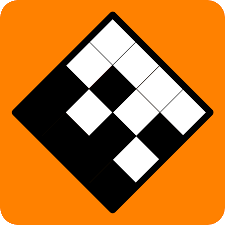

## 📈 Stats

  
   
  <a href="https://git.io/streak-stats">
    
  <a/>
   

## ⚙️ Technology
### Languages

### Frameworks & Libraries

  
  
  
  
  
  
  
  
  
  

### IDEs

  
  
  
  
  
  

### Software & Tools & Other

  
  
  
  
  
  
  
  
  

## 🔗 Profiles

## 💻 Coding Challenges  
### Advent of Code

  
  
   
  
  

### Codewars
  
  
### Project Euler

### Other

