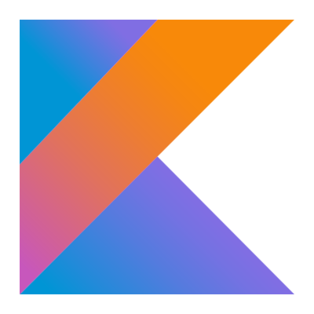
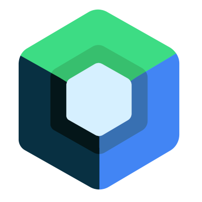
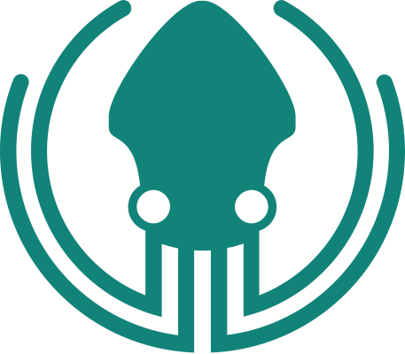

## 📈 Stats

  
   
  <a href="https://git.io/streak-stats">
    
  <a/>
   

## ⚙️ Technology
### Languages

### Favourite

  
  
  

## 🔗 Profiles

## 💻 Coding Challenges
### Codewars
  
  
### Advent of Code

  
  
   
  

### Other

